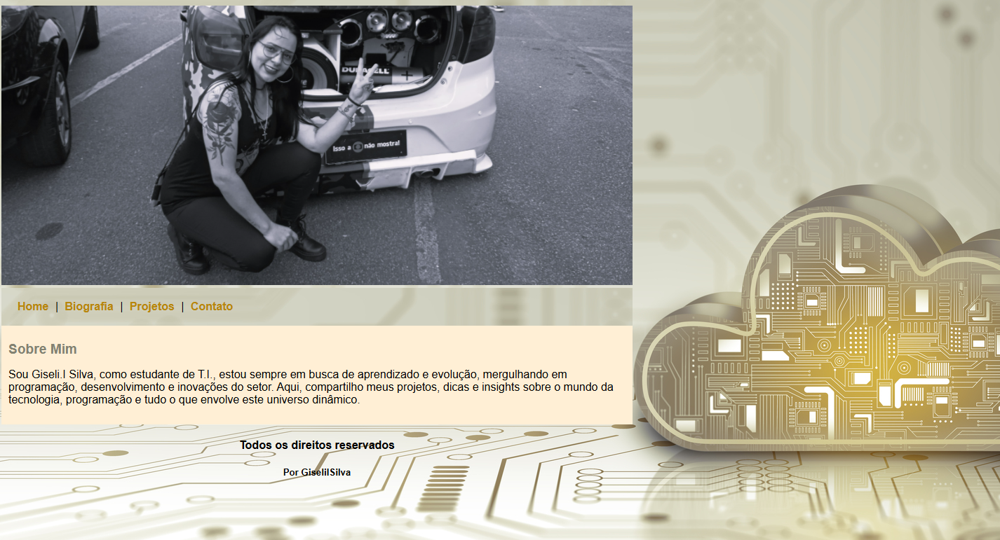

# Primeiro_Site
Primeiro Site Criado em HTML/CSS

# Portfólio Pessoal re

Este é meu portfólio pessoal desenvolvido com HTML e CSS. O objetivo é apresentar minhas informações de contato, 
biografia e projetos de forma organizada e atraente foi desenvolvido no ínicio do meu curso de HTML em 2024.

## Funcionalidades

*     **Navegação:** O site possui um menu de navegação que permite acessar as diferentes seções (Home, Biografia, Projetos, Contato).
*     **Informações Pessoais:** A página "Home" apresenta uma breve descrição sobre mim.
*     **Biografia:** A página "Biografia" contém detalhes sobre minha trajetória.
*     **Projetos:** A página "Projetos" exibirá meus projetos (a ser implementada).
*     **Contato:** A página "Contato" fornece minhas informações de contato.
*     **Design:** O design é responsivo e adaptado para diferentes tamanhos de tela (implícito pelo uso de `<meta name="viewport" ...>`).

## Tecnologias Utilizadas

*     HTML
*     CSS

## Como Executar o Projeto

Como este é um projeto apenas com HTML e CSS, basta abrir o arquivo `index.html` em qualquer navegador web.

## Autor(a)

Giseli Iraci da Silva

## Capturas de Tela

